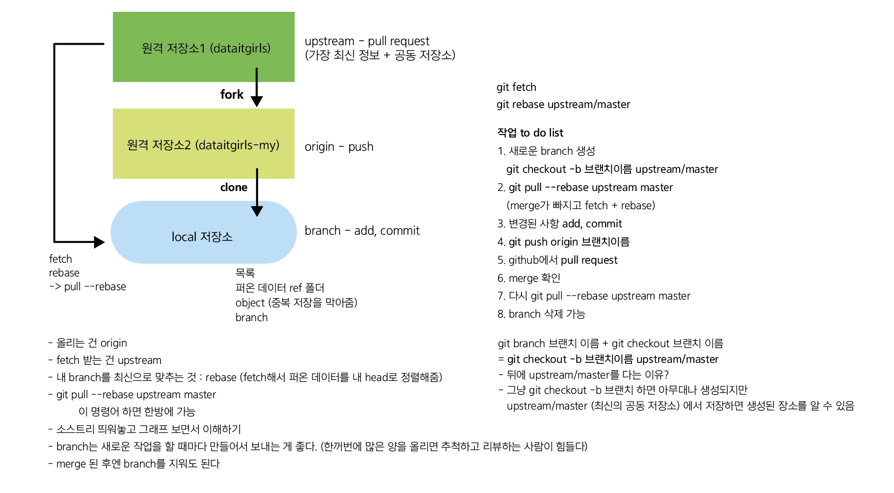

# PYTHON3_04

- github 탐구
- merge
- upstream 하는 방법
    - git remote add upstream repo의 원본 저장소(dataitgirls의 클론 주소)
- git pull origin master를 하면 불필요한 merge가 일어날 수 있다. 그걸 예방하기 위해
    - git pull —rebase origin master를 한다
- git fetch origin
- 올리는 거는 origin/ fetch는 upstream에서

 

- git checkout master

- git pull --rebase upstream master

- git push origin master

    → origin master를 업데이트 시키는 방법 

