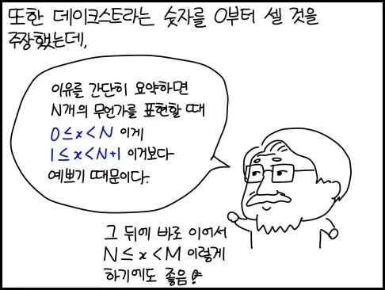

# Pyothon1

exprssion : 표현식: 파이썬에서 가장 단순한 단위 그냥 계산된 결과라고 본다

ex) 1 / 1+2 

statement : 명령문 : print:('hi') 실행해줌 → 요렇게 했을 때는 문장자체만 출력해줌 pirnt('')는 아무것도 아님. 계산된 결과는 없는 거고 실행은 hi를 출력해주는 거 / name = 'anne' 도 실행. anne만 있을 때는 표현식 이런식으로 화면에 뭔가를 출력하거나 상태를 바꾸는 거, side effect(부수작용) 을 실행해줌 

assignment : 명령 중에서도 독특한 개념. 할당 (이름 붙이기) name = **'anne'** → 할당 명령문 : 전체는 명령이고 명령 안에서 표현이 쓰이는 거. / a = **1+2** 

variouse : 변수, 이름에 해당. **name** = 'anne' 

연산자 : a **=** 1 **+** 2 / 연산자는 모두가 다 같지는 않음 우선순위가 있음 (부등호) 혹은 () 괄호 안의 연산 

function: 함수 **print**('hi') 

type : 나누기를 하거나 더하기를 했을 때 확인할 수 있음 / 1 을 놓았을 때 어떤 타입인지 / 어떤 타입은 일을 할수있는 지를 알아보기 위해 

1 → int(eger) 정수  

1.2 → float 소수점 : 그냥 나누기를 했을 때는 10/5 = 2.0 으로 나왔을 거임 나누기를 하면 무조건 float형으로 떨어지면서 계산값이 달라짐(정수 나 소수점으로 나올 수 있음) 그렇게 하지 않기 위해 하나로 통일 

그냥 나누기는 불확실하지면 그냥 유용하니까 쓰지만 딱! 떨어지고 싶으면 // 두번써서 정수로 %만 하면 나머지값만

error : 잘못 입력하면 나오는 값 

\ 역슬래시 : 익스케이프문자 

     "\"Hello, world\""
    '"Hello, world"'
     '\\'
    '\\'
    
     '\\( -ㅅ-)/'
    '\\( -ㅅ-)/'
     ''hit''
    File "<stdin>", line 1
    ''hit''
    ^
    SyntaxError: invalid syntax
     '\'hi\''
    "'hi'"
     "\"hi\""
    '"hi"'
     'hi'
    'hi'
     print('hi')
    hi
     print("\"hi\"")
    "hi"
     print('\'hi\'')
    'hi'
     print('\\( -ㅅ-)/')
    \( -ㅅ-)/
     print('\\n( -ㅅ-)/')
    \n( -ㅅ-)/
     print('\n( -ㅅ-)/')
    ( -ㅅ-)/
     print('\\n( -ㅅ-)/')
    \n( -ㅅ-)/
     print('/n( -ㅅ-)/')
    /n( -ㅅ-)/
     print('/n( -ㅅ-)/')
    /n( -ㅅ-)/
     print('\b( -ㅅ-)/')
    ( -ㅅ-)/

z = 'hello, world' → literal 이라고함 (리터럴) 

z + '!' (+ 는 더하기가 아니라 연결시켜준다는 의미) 

1 = 1 (에러) / = 은 이미 assignment(~는)의 의미로 썼기 때문에 같다라는 부등호로 못씀. (name의 의미로만,,,) 

그래서 나온거 

1 **==** 1 (참과 거짓을 다룸)

≠ ⇒ ! = 같지 않다 

<, > 

≤ → < = / ≥ → > =

1<2<3 연달아서 사용가능 

1 < 2 and 1 < 2 : 모든 요소가 연산자 = 1 < (2 and 1) < 2 같은 의미 

and : 둘다 참 

or : 하나만 참이어도 됨 

연산자에서는 우선 순위가 있다 

seconds_per_minute = 60

minutes_per_hour = 60

hours_per_day = 24

days_per_year = 365

seconds_per_minute * minutes_per_hour * hours_per_day * days_per_year

연습

실습 tip!

    "hello"
    
    print('"hello"')
    
    print("'hello'")
    
    print("'hello'"+'!')
    'hello'!
    
    print("'hello'"+'"!"')
    'hello'"!"
    
    
    

"와 '를 구분하는 이유는 Pirnt( ) 에서 문자값을 빼낼 때, ''를 붙이고 싶거나 ""를 붙이고 싶을 때 유용하다 

위에 문자열을 그대로 가지고 오고 싶으면 방향키 위 로 계속 올라가거나 조종할 수 있고 밑 키 누르면 밑에꺼 복사됨 

파이썬에서 입력할 때 연산은 숫자끼리 / 문자열끼리만 가능하다 

문자를 숫자로 지정하고 싶을 땐 

z = 12

그냥 이렇게 치고 

z 

12 

print(z)

12

값으로 다음부터는 출력됨 

#2

    name = 'Anne'
    
    score = 100
    
    print(name, score)
    
    
    score1 = 80
    
    score2 = 90
    
    score3 = 70
    
    print(name, score1, score2, score3)
    

scores = [80, 90, 70] : 여러개를 한번에 관리

print(name, scores[0], scores[1], scores[2]) / 프로그래머들은 0부터 시작 (벡터) 0:원점 1:한칸옆으로 2: 두칸옆으로 (그래서 80,90,70) → 숫자를 대입하는 게 아니라, 순서라고 생각 

    #
    
    total_score = scores[0] + scores[1] + scores[2]
    
    print(total_score)
    
    #
    
    total_score = 0
    
    print(total_score)
    
    #
    
    total_score = sum(scores)
    
    print(total_score)
    
    #
    
    subjects_count = len(scores)
    
    print(subjects_count)
    
    #
    
    average_score = sum(scores) / len(scores)
    
    print(average_score)
    
    #
    
    min_score = min(scores)
    
    max_score = max(scores)
    
    print(min_score, max_score)
    
    #
    
    scores = [10, 20, 30, 40, 50, 60]
    
    some_scores = scores[2:4] → 개수가 아니라 순서! 
    
    print(some_scores)
    
    [30, 40] → 프로그래머들의 이상한 습관,,, 시작은 0이고 끝은 -1(끝은 생략합니다) 그래서 30,50이 나올거라고 생각하지만 20,40(50의 전) 이 나온다..! **끝번호는 세지 않는다. (이상_미만) 으로 생각** 
    
    some_scores = scores[:4] 
    
    print(some_scores)
    
    [10, 20, 30, 40] → 앞에 조건을 안쓰면 처음부터 ~ 끝 순서! (따지고 보면 개수 세는 거랑 똑같음)  
    
    some_scores = scores[2:] (앞번호는 셈) 
    
    print(some_scores)
    
    [30, 40, 50, 60]  → 뒤에 조건을 안 쓰면 끝까지 
    
    some_scores = scores[:]
    
    print(some_scores)
    
    [10, 20, 30, 40, 50, 60] → 안쓰면 처음부터 끝까지 그대로, 근데 왜 쓰냐? 만약 [:] 생략하면 some_scores 가 scores다. 라는 의미지만 [:] 붙이면 scores의 전체값이 some_scores다. 라는 뜻 (다름!) 전체 선택을 해서 복붙한다는 뜻 
    
    #
    
    some_scores = scores[::-1] → 맨뒤에 있는 건 스텝 이라고해서 어떻게 움직이는 가 그래서 역순! **:-1** 
    
    print(some_scores)
    
    [60, 50, 40, 30, 20, 10]
    
    some_scores = scores[2:4:-1] → 2(30)에서 4는 정방향이니까 역순이 존재 불가능 그래서 없는 값
    
    print(some_scores)
    
    [ ] 
    
    some_scores = scores[4:2:-1] → 4(5) 에서 2까지(그치만 2마지막은 세지않음 30) 그래서 50, 40 
    
    print(some_scores)
    
    [50, 40]
    
    some=scores[:-1] → 뒤에서 하나빼기 
     some
    [10, 20, 30, 40, 50]
     some=scores[:-2]
     some
    [10, 20, 30, 40]