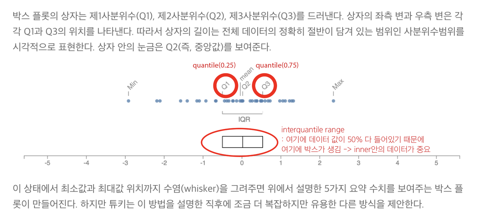

# PANDAS 03

- 기초통계
- yeeunhan/Basic Statistics for Data Analysis.ipynb

## [box and whisker plot](https://boxnwhis.kr/2019/02/19/boxplot.html)

- 박스 플롯을 좁은 간격으로 나란히 그리면 여러 데이터 뭉치를 쉽게 비교할 수 있음
- titanic survived box plot 비교
    - 80세 할아버지는 살았음
    - 나이가 어린 사람들 그룹이 더 많이 살아남은 게 보임

    

## 상관관계

- 공분산 : 두 변수가 join해서 분산이다 / 두 분산 간의 관계가 얼마나 깊은 지를 보여줌
- x = [1,2,3,4,5] x1평균 = 3
- y = [ -1, -2. -3. -4. -5] y1평균 = -3
- x-x1 = [-2, -1, 0 , 1, 2]
- y - y1 = [2,1,0,-1,-2]
- x-x1 * y-y1 를 짝지어서 곱해주라
    - -2*2/ -1*1, 0*0, 1*-1, 2*-2
    - -4 , -1, 0, -1, -4
    - 평균값 : -2
    - - 사이 값이 가 나오면 반비례/ + 가 나오면 비례 관계
    - 
- # 공분산에서 x와 y의 크기에 따라 영향을 많이 받아서, 아까 root를 씌워준 것처럼 상관계수를 구해준다
- -1~0 사이 값이 가 나오면 반비례/ 0~+ 가 나오면 비례 관계
- 상관계수가 0 일때는? 데이터가 위로 가거나 아래로 가는 트랜드가 아니면 0이 나오게 됨 (그림 참고)
- 그래야 트랜드를 알기위해(위인지 아래인지) 꼭 데이터 값을 찍어봐야함
- 심슨의 역설 : 전체적으로 볼 땐 양의 상관관계인데, 그룹별로 나누면 달라지는 경우가 있음 (그림)
- 그렇기 때문에 데이터를 자세하게 설명하기 위해서는 그룹별로 나누어서 분석하는 게 좋다
- 텍스트 데이터를 공분산 하기 어렵기 때문에 1.0으로 변환해서 계산한다. (titanic의 sex 데이터가 안 나오는 이유)
- 탐색적 데이터 분석 : EDA