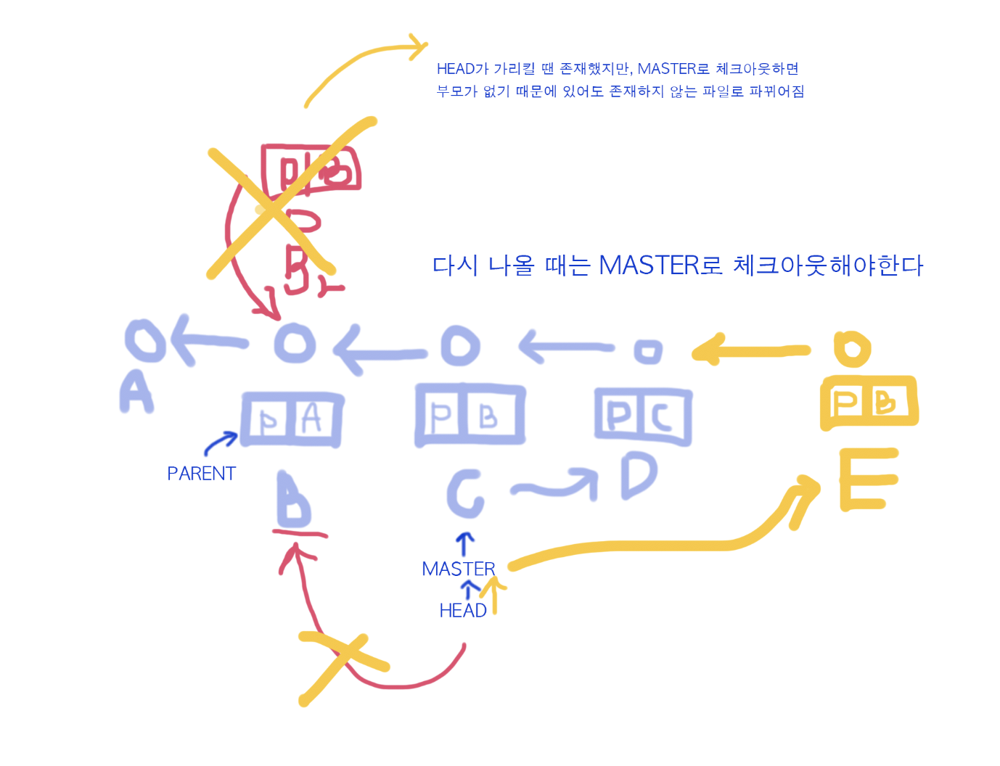

# GITHUB from the hell

[이고잉_데잇걸즈](https://github.com/egoingsb/dataitgirls-info)

리눅스 - 깃을 처음 만들 때 한줄로 from the hell 이라고 설명 

4세대 버전 git이 세상을 지배 - 좋은 기능 때문 / 사용성은 반비례 

복잡한 데, 내부의 매커니즘은 심플/ 사용성이 나쁜 이유 - apple이 안만듬 ^^ 

프로그래머들의 버전 관리 시스템 

어느 순간 왜곡되서 본질을 잊게되는 경우 ex) 오디오 - 음악 

깃을 처음 시작 - 버전을 만드는 것 / 그 뒤의 branch , overflow ,,,,

 

## 버전을 만든다 - 첫번째 시간 

버전을 다룬다 

왜 깃이 환상적인지 충분히 공감하는 게 3일동안 할 일 

git extensions 가 안되서 sourcetree로 바꿈 

**crud →  (정보) creat read update delete** 

생성된 버전을 어떻게 생성하고 읽을 것인가 (70%)

하나의 버전에 복수의 파일을 포함시키는 방법 

stage area 여러개의 파일이 수정되었을 때 원하는 만큼만 분리해서 버전을 만들 수 있음  → 대신 사용하기 어려워짐 

working directory = project folder 

git이 등장하기 전까지는 stage 라는 개념이 없었음 

 

**repository** 저장소 : **.git(숨긴 폴더)** 

**working dir**: 실제로 작업한 폴더/디렉토리를 제외한 나머지 > 파일 수정 

**stage** : 체크박스, 파일 올리는 공간 

**add** : 저장하고 싶은 정보를 stage 로 올림(앞마당)

**commit** : stage에 올린 정보를 .git 으로 저장하게 해줌 (버전 및 업데이트 저장) 

버전 관리는 시간을 기록하기 때문에 예전으로 돌아갈 수 있음 

깃은 어떤 것도 지우지 않고 안전함 

히스토리에서 원하는 버전을 클릭하면 됌! (무조건 다 commit한 상태여야 가능) 

다시 해도 되돌릴 수 있음. 그리고 이게 된다고 해도 파일의 진짜 내용은 바뀌지 않음 

파일의 이름을 바꾸지 않고 모든 버전을 보관함

복귀 할 때 : master 클릭 → 내가 가장 마지막에 만든 버전을 가리키고 있음 → 클릭 → (head 사라지고 master만 남음) head와 master 일치해짐 

 

**head** : 내가 checkout한 곳에 머물고 있음  (오늘의 주인공) / 옆에 직선(파란선)의 동그라미가 head (검은 동그라미) : 헤드는 가만히 있는 데, 마스터가 움직이기 때문에 움직이는 거 같음 

마스터는 나의 최신 커밋이 누구냐 

**버전** : 워킹 카피의 스냅샷 

head는 나의 워킹 카피(지금 작업하는 파일)가 어느 버전에서 유래했냐를 알려주는 정보 

**ckeckout은 head를 옮긴다** 

master는 최신 버전을 가리킨다 

head는 마스터를 통해서 최신버전을 가리키는 효과 

시간 여행 후 꼭 마스터를 클릭해서 최신버전으로 돌아온 다음 작업을 수행해야 한다!! 

실험하거나 망할 거 같은 작업을 할땐 working 파일 옆에 복붙해서 하나 생성하면 안에 .git 이 있기 때문에 모든 버전이 다 들어있음 

discard → 한글판 : 커밋 초기화 (내용 수정했는 데 커밋 전에 없애고 싶을때!) stage area에 있는 파일을 왼쪽마우스_커밋 초기화 시키면 됌 ㅇㅇ 

모든 커밋은 부모가 있음 (제출 Id) 각각의 버전마다 고유의 식별 번호가 존재 

커밋은 헤드가 가리키는 애를 부모로 한다. 

git을 보면 제일 먼저 head를 본다. 가리키는 파일이 그대로이거나 그 이후에 수정된거구나를 파악. 

head가 master를 직접 가리키지 않은 상태 = detached 헤드가 마스터와 떨어진 상태다 그러면 head의 parent는 현재 head가 가리키는 파일이다. 

 → ***이 상태로 다시 master로 가면 부모는 그 전이 아니라, 옮겨진 버전에서 유래한다.***

parent는 그 전에 head가 어디를 가리키고 있는 가

버전은 워킹 카피의 스냅샷이다. 스테이지는 수정한 부분을 보여주는 장소.

C와 D를 지우고 싶을 때 → git에게 b로 reset해 라고 하면 마스터가 B로 바뀜 (마스터를 이 커밋으로 초기화) 모드는 hard로 → head와 master가 같은 위치에 있어야함 

(체크아웃하면 head가 바뀜)→ 시간여행이 되기도 하고 삭제가 되기도 함 

ckeckout : 시간여행 

reset : 삭제 (delete와는 다름, 더 복합적) 헤드가 가리키는 브랜치(master)를 바꾸는 것 *브랜치가 마스터 말고 여러 개 있을 수 있다는 암시 ^^ 

**브랜치** : 마스터가 가리키는 정보 

c d 다시 살리기 

- git은 아무것도 지우지 않는다.
- reset은 마스터를 움직인다.
- 하지만 우리는 커밋 아이디(주소)를 안다.
- 맨 최신의 주소를 알면 그 밑의 버전들도 바로 업데이트 됨
1. reset전 가장 좋은 건 저장소 전체를 카피하는 것
2. 아니면 커밋 아이디 카피_터미널에 git reset - - hard 커밋아이디주소 

 하면 다시 나옴 

3. 다른 방법은 나중에 알려주심 

 
 

커맨드 라인 - 터미널 에서 깃 사용하기  

**CLI (커맨드라인인터페이스) - 키보드, ok google**

**gui 그래픽 유저 인터페이스 - 터치, 마우스**

비스코 - 에디터 (코드를 편집하는 툴): cli 내장되어있음 ctrl + j 

terminal 설정 맞추기 

view - command palette → default shell → bash 

 

**1. 상태확인 (제일 먼저하는 거) 내가 지금 어디있지? : pwd 엔터**

**2. 내가 있는 곳엔 어떤 파일이 있나 list : ls / ls -l (자세히보기)/ ls -al (숨긴 거 안 숨긴 거 모두 자세히 보여줘)**

**앞 단어 → 명령어 / 뒷 단어 → option = 커맨드라인의 핵심적인 문법** 

**drwxr-xr-x / D : 디렉토리** 

**-rw-r--r— / 디렉토리가 아니다 파일이다** 

**3. status 체크 (상태 체크) → git에서 pwd에 해당되는 내용** 

**untracked: 관리되고 있지 않은 상태** 

**4. git add 파일이름 : 파일을 관리해줌 → working 에서 stage area로 가는 법 (소스트리에서 체크 박스)  : 2가지 일을 해줌 1) 파일 추적 2) stage로 올리기도 함** 

git add index.html index2.html → 요렇게 동시에 해줘도 되고 따로따로 해도됨 

**5. git status 체크 → changes to be committed/ new file = 최초로 추척된, 하지만 아직 커밋 안 된 파일이다**  

**change : 버전과 전 버전 사이의 차이** 

**6. git commit -m"  " / m 메세지 → 버전 하나 생성** 

**7. git diff : 수정 후 (add하기 전) 전 버전과 다른 점을 볼 수 있다**

git 하고 tab 누르면 파일 이름 볼 수 있음 

**8. git log : 내가 한 버전들을 다 볼 수 있음 (소스트리의 history) 나가고 싶을 땐 q 누르기**

    git log --oneline : 한줄로 심플하게 log를 보고 싶을 때 

    git log --oneline --all (헤드나 마스터가 가리키는 커밋들 다 보여줌)

    git status : repository의 현재 상태를 알고 싶을 때 

    log : commit 들과의 관계 (역사 확인) 

**9. checkout 시간여행 (head 옮길 때) git checkout 5d1a9cb → 파일 아이디** 

    git checkout master → 다시 master로 돌아오는 방법 

**10. git reset(헤드가 가리키는 브랜치를 바꾸기) — hard 깃 아이디  : commit 지우기** 

    git reset --hard 5d1a9cb 

삭제가 된 것은 아니지만, 잃어러린 것. 

**11. 다시 찾는 방법 (되돌리기) git reset —hard 원하는버전의 git id** 

    git reset --hard da7a568

 

## html

index.html

만들고 안에 내용 쓰고 저장 

크롬 ctrl + o 해서 만든 거 불러오면 웹페이지 생김. 

    밑줄 U(언더라인) <u>welcome my homepage.</u>

    기울기 : <i>homepage</i>

→ i 와 u 같은 거 : 태그 

      줄바꿈

없으면 시작되는 태그 /가 있으면 끝나는 태그 

근데 br은 없다. 왜냐면 줄바꿈은 뭘 설명할 필요가 없기 때문! 

    list 목록 <li></li> 앞에 * 생김 → 부모가 있어야함

    <ul></ul> 목록 그룹화 → 자식이 있어야함 

    숫자 붙이기 <ol> </ol>

 

왜 커맨드라인을 쓰는 지, 왜 좋은 지, 왜 나쁜 지 생각하면서 쓰기 

    git init (소스트리에서 새로은 repository 만드는 거) 

Q. 버전 아이디를 모르면(깃아이디) 다시 못 되찾나? 

    git reflog 엔터 (내가 했던 operation들을 보여줌)

(노랑색)오른쪽이 결과 / 왼쪽이 원인 

여기서 보고 다시 아이디를 찾아서 하면됌. 

깃은 결국 안지운다~! 내 모든 걸 다 추적함. 

내가 명령어를 찾아내면 옛날 기록들을 다 찾을 수 있음 

    git relfog → 했던 모든 행위를 반복 

[GITHUB from the hell2](./GITHUB-from-the-hell2-78f1702c-d4ba-4dd2-823e-0594fe93ab44.md)