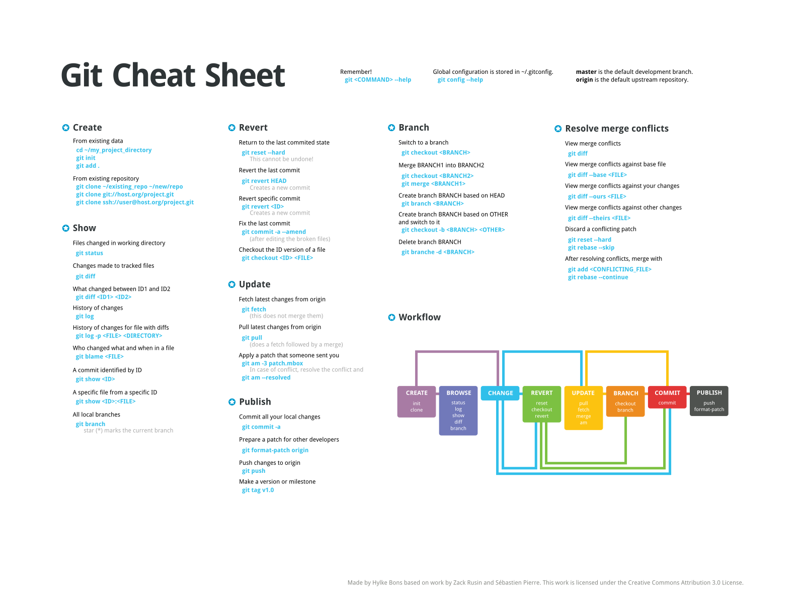
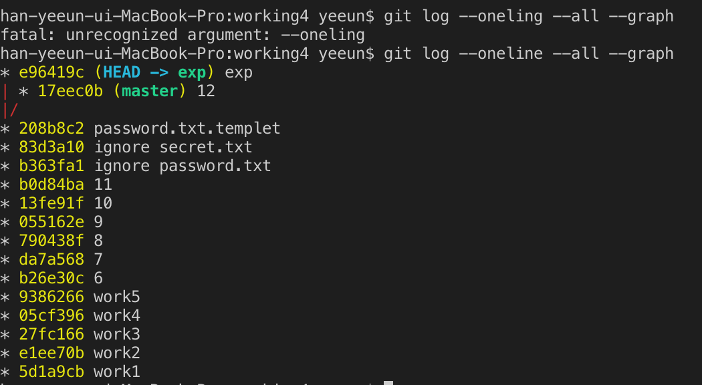

# GITHUB from the hell2

## 1 복습 

비스코 오른쪽 마우스 - open with code 하면 편리 

치트 시트 찾아보기 (이미 개발자들이 만들어놓은 시트, 높은 확률로 많이 쓰이는 작업들 모아놓음) 

## 폴더 만들기 

    mkdir - **m**a**k**e **dir**ectory

    mkdir 폴더이름 

내가 위치한 디렉토리를 바꾸고 싶음 (채인지) 

    cd - change / directory 

 

## 운영체제 
* 두가지의 중요한 운영체제가 있고 window/ unix-linux (mac) 각각의 명령어가 다르다 

* git은 기본적으로 unix 체계

* 그래서 window도 unix 명령어를 이용해서도 사용할 수 있는 프로그램을 만듬 → emulator 

* cd .. → .. 은 부모 dir 로 하자 / 부모 dir로 이동함 : 내가 어디 있느냐에 따라 부모가 다르기 때문에 상대적 경로 // 

    han-yeeun-ui-MacBook-Pro:123 yeeun$ cd ../../..

    han-yeeun-ui-MacBook-Pro:Users yeeun$ pwd

    /Users

* cd 폴더이름 → 이것도 상대적인 경로 (왜냐면 내가 부모 폴더에서 폴더이름으로 갈 수는 있지만, 다른 곳에 위치해있다가는 갈 수 없기 때문) 

* 절대적인 경로 : 직접 폴더 위치를 지정해서 움직이는 것 

        cd /Users/yeeun/Desktop/working4 → 요렇게 아예 지정해서 가는 거 

* drwxr-xr-x 3 yeeun staff 96 7 30 10:16 .

* drwxrwxrwx+ 35 yeeun staff 1120 7 30 10:20 ..

* drwxr-xr-x 10 yeeun staff 320 7 30 10:16 .git

        → 여기서 . 은 나(현재 dir) ..은 부모파일

* cd ./폴더이름 → 원래는 이렇게 치지만 ./ 를 안써도 있다 치는 거임 

* rm → remove 폴더 지우기가 아니라 파일 지우기 ㅎㅎ 

        dir은 지워지지 않는다 (위험하니까..!) 

        그래서 지우려고 할 때는, rm -r 이라는 옵션을 써야한다 

        (리커시브:재귀적인 의 약자) 

* rm -rf (force) 묻지도 따지지도 말고 지워라 

        /: 최상위 디렉토리 (루트) 

        rm -rf / 하면 난리남....

        [농협사태를불러온무섭지만간단한명령어들](https://ojava.tistory.com/30)

* 리눅스 체계 특징은 오류가 생기면 말을 하고 아니면 아무 말 안함 

* 좋은 엔지니어는 적당한 비극 속에서 피어나는 꽃,,,파괴는 안됨 ^^ 

 

## index3.html 

terminal 2:bash 

    cd /. → 루트 dir 

    git commit -m "work 1" → 만약 파일 이름에 띄어쓰기를 할거면 "" 로 문장으로 묶어주기 

    작업이 끝나고 리뷰할때 git diff 

    git commit -m " " -a  → 에드와 커밋을 한방에 하는 명령어! → **git commit -am** "9

* 모든 파일은 최초의 add를 해주어야 한다  : stage에 올라간 이력이 있어야만 commit을 바로 써줄 수 있다 

* 그 후에야 git commit -am 같은 명령어를 쓸 수 있음 (바로 커밋을 할 수 있음) 

* 내가 add하기를 원하지 않는 파일을  빼고 add commit하는 방법 - 버전에 포함도 안되고 status 할 때도 무시하고 싶을 때 : dir안에 .gitignore 파일을 안들고 안에 내용에 포함하지 않기 원하는 파일명을 적는다. 

* → 글면 .gitignore 라는 파일은 만들어지고 안의 파일은 보이지 않는다. 그다음 .gitignore를 에드해서 커밋하면 아예 git에 저장해버린다(왜냐면 .gitignore도 빨간 글씨로 계속 untracked라고 뜨면 빡치니까...) . git commit -am"ignore password.txt" 이런식으로 아예 버전을 만들어줘버림. 

* 그러면 협업을 할 때도 숨겨진 파일과 폴더가 있음을 알 수 있게 됨. 

* **add : 올리고 싶지 않은 파일은 올리지 않도록 하는 안전 장치이기도 함.** 

* **.gitignore** 파일이란 Git 버전 관리에서 제외할 파일 목록을 지정하는 파일 이다.
* git으로 프로젝트를 관리할 때, 그 프로젝트 안의 특정파일들은 관리할 필요가 없는 경우가 있다. 예를 들면, 프로젝트 설정파일, 자동으로 생성되는 로그파일(ex.*.log), 빌드할 때 생기는 컴파일된 파일(ex. *.class) 등이 있다. 따라서 이런 관리할 필요가 없는 파일들을 git이 track 하지 않도록 .gitignore을 설정하는 것이다.

* history 라고만 치면 지금까지 했던 명령어들이 출력됨. 

    ctrl c : 실행취소 

* 근데 만약에 구체적인 내용말고 형식만 만들고 싶을 때는 새로운 파일로 password.txt.templet 으로 만들어서  형식만 복붙해서 넣은 후 커밋시키면 됌. 

 

## 오늘의 주인공은 branch (master) 

3 bash 

* **head : 나의 워킹 카피가 어느 버전에서 유래했는 지 알수있게 해줌** 

* h : m 가 같은 상태면 head가 마스터를 통해 가리키고 있음 (물론 직접 버전을 가리킬 수도 있음) 

    git checkout gitid(원하는 버전)

* 다시 돌아오는 방법도 동일함 

    git checkout gitid(마지막최신버전) 

        - 시간여행을 하는 이유? : 내가 작업을 하다가 애매한 기능 혹은 인류가 쓸 수 없는 기능을 추가했을 때 하나는 성공했는 데, 그 뒤 작업들이 거의 막 10년쯤 걸리면 1) 삭제 2) 시간여행 이런식으로 쓸 수 있음 

    

* B와 C를 지운다 → master의 버전을 A로 옮긴다 

    git reset a 

* 코드 꼬여서 안될 때 빡친다는 걸 배움 

 

## <BRANCH>

* 기본 브랜치 : master

    git branch 이름 

* 브랜치 확인하고 싶을 때 - git branch 

* 그림 설명: Head는 master를 가리키고, exp라는 브랜치가 생성됨 

* 이 상태에서 새로운 파일을 주가하고, 커밋시켜서 버전을 업데이트하면 달라짐 

m* aster는 최신버전으로 옮겨지지만, exp는 커밋을 시키지 않았기 때문에 생성된 버전에서 머물고 있음. (주작업이 master 브랜치에서 이루어지고 있기 때문) 

* 여기서 c 파일로 돌아가 수정하고 싶을 때 

    git checkout exp 

* 그리고 여기서 새로운 버전을 업데이트 시키면 (그래프 보려면)

    git log --oneline --all --graph

* 만약 all을 안붙이면 exp만의 그래프가 나오고, master로 체크아웃한 상태에서 그랬다면 master만의 그래프가 나온다 

* → password.txt.templet까지는 공통작업 

* exp 부터는 exp만의 작업 

* 만약 master로 돌아간다면 12부터는 마스터만의 작업 

    다시 돌아갈 때 git checkout master

* 만약, branch를 밑 버전에서 추가하고 싶을 때 

* git checkout 원하는 버전 갔다가 

    git branch 0000 생성 

    git checkout 0000 (요거 한번 더 하는 이유는 head,exp 상태를 head → exp 만들어주기위해)

    하고 git log —oneline —all —graph 해서 결과보기 

* 여기서 또 수정하고 커밋시키면 재밌음 

* 근데! 만약 git chekout 0000 했다가 .gitignore 했던 파일 전 버전으로 간다면 저 파일들은 잔류해서 남아있긴 한데 다시 untracked files로 나옴. 그래서 다시 해야함. (근데 사실 이 버전으로 돌아간다는 뜻은 더이상 숨긴 파일이 필요없다는 뜻이기도 함) 

 

# 브랜치 지우는 방법 

* 내가 지우기를 원하는 브랜치 말고 다른 브랜치도 checkout  하고 해야함 

        git branch -d 0000

* → 이러면 한번 더 확인하라는 뜻 (병합안할거니..?) 나오고 진짜 지우고 싶으면 

    git branch -D 0000 대문자를 써라 

## 병합 merge

* 원리

* master로 exp(에서 작업했던 것들을)를 병합 

1. git checkout master 
2. git merge exp 

* Merge branch 'exp → 자동으로 커밋 메세지를 만들어줌 (이 버전은 exp다) 

* 소스트리 병합 : master를 더블클릭해서 체크아웃 한 후, 원하는 브랜치 오른쪽 마우스 

* 다시 병합 전으로 가고 싶을 땐 

    git reset —hard 17eec0b 로 가야함 (그러면 지금 head가 master를 가리키고 있기 때문에 마스터가 움직임) 

 

## merge 의 conflict를 다루는 법 

* bash 5 

1. dir 에서 파일 만들고 커밋하기 
2. git branch exp 만들기 
3. git branch master 상태에서 

    파일 수정하고 커밋 

4. git checkout branch 한 후, 파일 수정하고 커밋
    - git checkout -b exp (브랜치 만들고 체크아웃하는 거 한번에)
5. master로 exp를 병합한다 
6. git merge --abort : 충돌했는 데 망한거 같아 그래서 병합 취소 (병합 취소)

---

* → 이렇게 뜸 :: 내가 지금 체크아웃 해 있는 버전은 head → master 인데 exp 버전에 똑같은 줄에 같은 정보가 써있다. 그러니 너가 해결해라 

7. 수동으로 수정하기 

* 혹은 내가 넣고 싶은 정보를 저 맨위에 있는 글자들을 선택해서 정보값을 바꾸면 됨 

7. 소스트리에서 uncommitted changes에서 밑에 파일에 오른쪽 마우스 

    command 에서는 

    git status 하면 unmerged paths: 라고 적혀있음 그래서 git add 파일 해서 해결했다고 알려줘! 라는 메세지가 나옴 add의 삼대 의미 (add는 충돌을 해결했다!)

    git add 파일이름 

8. 소스트리에선 커밋하면 됨 (병합하면서 생긴 커밋이라는 걸 알기때문에 자동적으로 merge commit이라고 뜸 

    1) merge 하기 전에 충돌날 내용 수정해서 병합하기

    2) merge 시키고 에러난 부분 수동으로 수정해서 다시 병합

    3) merge 시키고 에러난 부분 선택해서 다시 병합

     

* 2way merge는 충돌이 많이 발생한다. 

* 3way merge가 생김 → 원본 파일을 참조하면 되지 않아? 라는 생각! 

* 깃은 항상 한쪽과 다른 한쪽의 공통분모(부모)를 찾음 

    → **base** 라고 함 

 
 

* 낼은 협업 배움 

[GITHUB from the hell3](./GITHUB-from-the-hell3-12b9f55d-0278-489b-80cb-f9244061aba9.md)