# GITHUB from the hell3

## 인트로

- 전기  - 호박(보석)

- 알파고

- 무지한스승 

- 협업 

- *** 매일매일 github에 일기쓰기

- Q. vim과 nano 의 차이 → nano가 더 좋음 (더 쉬움) 

- **내가 해결하고 싶던 문제 : 새로 깐 oh my zsh 에서 rubbyrusell log가 딴 페이지로 나올때 문제 해결 : git --no-pager log --oneline --all --graph** // —no —pager 추가하면 됨 

- snip & paste / 맥: 

---
 

## Gistroy (파이썬)

 

기능/코드/ .git 

새로운 파일을 .git 저장하고 gistory 가보면 요런 파일들이 생김 

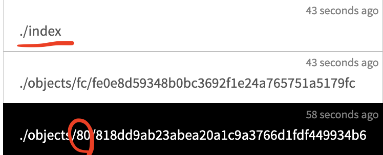

같은 폴더에 전에 올린 파일을 복사하고 파일명만 다르게 한 후, add 하면? (파일명은 다른 데, 내용은 같으면?)

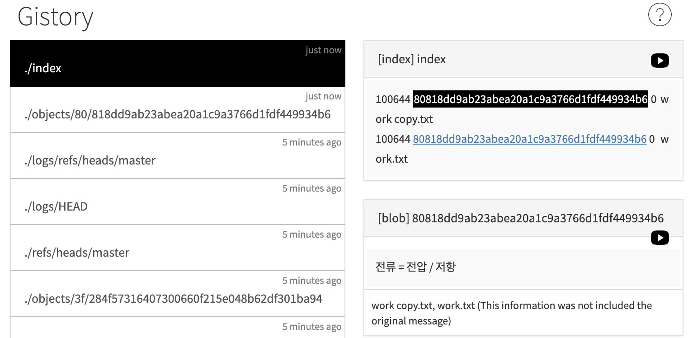

인덱스의 아이디가 똑같은 양상 (똑같은 컨텐츠가 있기 때문에 암호코드가 똑같음) 

2) 파일명과 내용이 다른 파일을 만들고 add 시킨다면? 

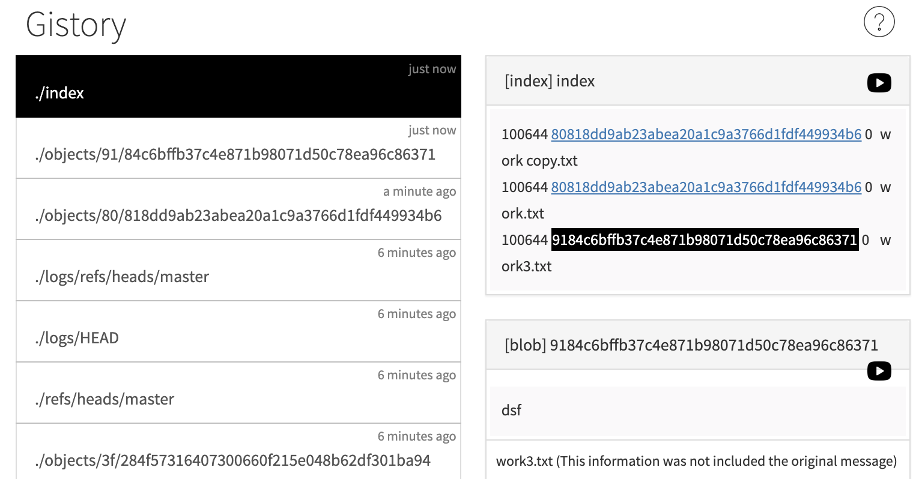

다른 git id가 새겨진 파일이 만들어짐 

굉장히 효율적으로 콘텐츠 관리해줌 

버전이 생길때마다 저장하는 데, 

깃에서는 (블록체인도 비슷) 컨텐츠의 내용을 기반해서 파일명이 결정된다. → hash 라고 함 

[http://www.sha1-online.com/](http://www.sha1-online.com/)

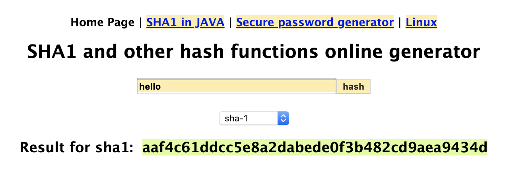

→ 컴퓨터가 달라도 동일한 컨텐츠(hello)에는 같은 코드가 부여됨. 하지만 같은 코드로 컨텐츠를 만들 순 없음 → 반방향 암호 

git 에서 파일을 저장할 때 sha1이라는 암호 코드를 이용해서 코드를 만들고 저장하는 데, 똑같은 내용이라면 같은 암호코드가 부여되기 때문에 저장 용량이 증가하지 않음! 

git add를 할때마다 파일의 내용과 이름이 gistroy의 .\index에 추가됨 → stage 임 / 어떤 사람은 index라고 하고 어떤 사람은 stage라고 하고 어떤 사람은 cash라고함 

index - 매커니즘 / stage - 사용자관점 

이 상태에서 커밋을 하면 인덱스 안의 파일 내용들의 사진을 탁! 찍어서 버전을 만들어줌 (커밋 아이디를 만듬)

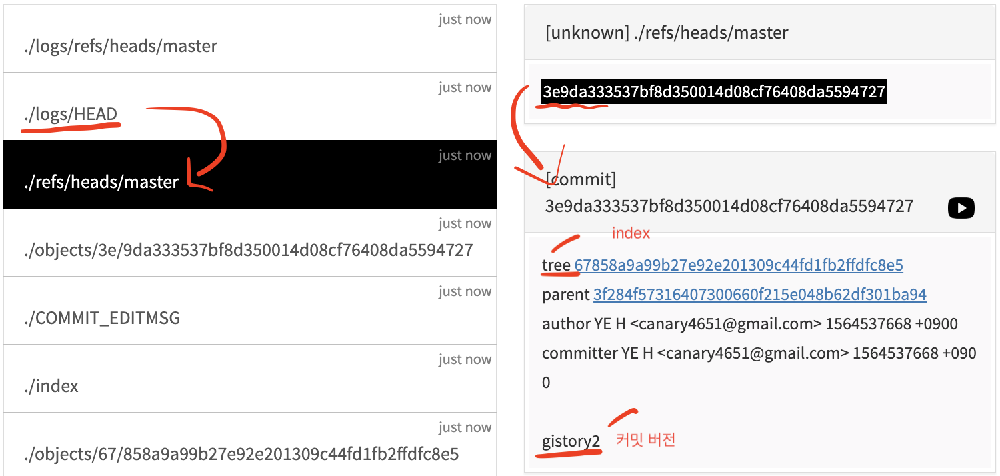

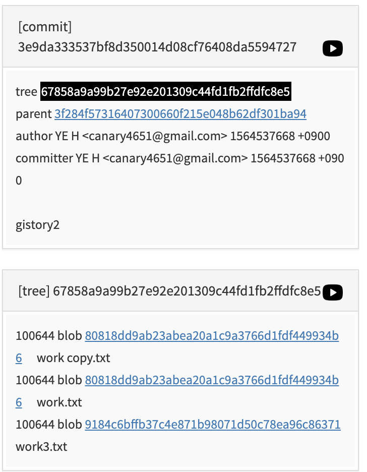

네이버 데이터 급상승 트랙킹 

![]./git_images/(Untitled-c520bdb8-efca-4940-ac50-b45b6308ce37.png)

view-source:[https://datalab.naver.com/keyword/realtimeList.naver](https://datalab.naver.com/keyword/realtimeList.naver)

 
---
 

curl + 인터넷 주소 

301 Moved Permanently → 정상적인 접근이 아니어서 block

뚫는 방법 : curl 할 때 크롬같이 웹브라우저인 척 

[https://stackoverflow.com/questions/28760694/how-to-use-curl-to-get-a-get-request-exactly-same-as-using-chrome](https://stackoverflow.com/questions/28760694/how-to-use-curl-to-get-a-get-request-exactly-same-as-using-chrome)

    ls > ls.txt (화면에 출력하는 법) : 이거 하면 바로 파일 추가됨 

    curl -H "User-Agent: Mozilla/5.0 (Macintosh; Intel Mac OS X 10_10_3) AppleWebKit/537.36 (KHTML, like Gecko) Chrome/44.0.2403.89 Safari/537.36" [https://datalab.naver.com/keyword/realtimeList.naver](https://datalab.naver.com/keyword/realtimeList.naver) > naver.html && git add naver.html && git commit -am "update naver"

**> 리디렉션 뜻 / && : 앞에 있는 명령이 실행되었을 때, 뒤에 있는 명령이 실행** 

**; (앞에 있는 명령이 성공했던 말건 뒤에 거 실행)**

 

→ 더 심플하게 만들기 

굳이 복사하지 말구, 너가 알아서 실행해! 

***bash*** 

    bash [sync.sh](http://sync.sh/)

워킹 dir에 [sync.sh](http://sync.sh) 파일을 만들고 그 안에 

    curl -H "User-Agent: Mozilla/5.0 (Macintosh; Intel Mac OS X 10_10_3) AppleWebKit/537.36 (KHTML, like Gecko) Chrome/44.0.2403.89 Safari/537.36" [https://datalab.naver.com/keyword/realtimeList.naver](https://datalab.naver.com/keyword/realtimeList.naver) > naver.html && git add naver.html && git commit -am "update naver" 

복사하려는 컨텐츠를 넣고 저장 

그 후에 명령어에 bash  [sync.sh](http://sync.sh/) 하면 됨 

* → bash while roof : sleep를 안 쓰면, 0.1초마닼ㅋㅋ 업데이트 됨. 그니까 sleep 시간초 써서 5초마다 업데이트해 라고 하기 (sync.sh 파일에 저장하고 실행)

    while true

    do

    curl -H "User-Agent: Mozilla/5.0 (Macintosh; Intel Mac OS X 10_10_3) AppleWebKit/537.36 (KHTML, like Gecko) Chrome/44.0.2403.89 Safari/537.36" [https://datalab.naver.com/keyword/realtimeList.naver](https://datalab.naver.com/keyword/realtimeList.naver) > naver.html && git add naver.html && git commit -am "update naver" 

    sleep 5

    done 

→ **bash while roof** : sleep를 안 쓰면, 0.1초마닼ㅋㅋ 업데이트 됨. 그니까 sleep 시간초 써서 5초마다 업데이트해 라고 하기 // ctrl+c 누르면 빠져나옴 

---

 

데이터 비전공자 취업 → 관심있는 기업의 도메인 분석 같은 것을 미리 알아놓고 분석하기 

브랜치 추가하면 보이는 gistory

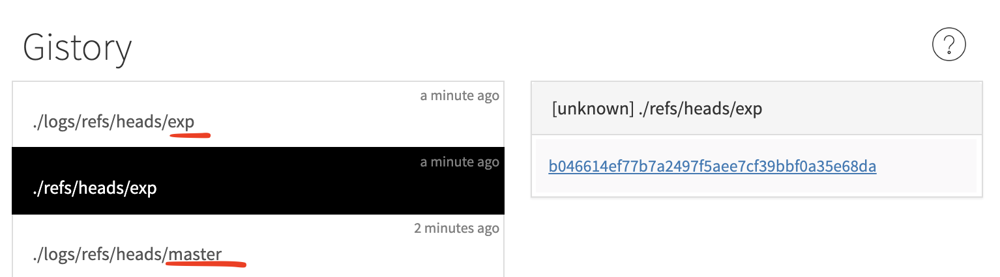

**merge** 

1. git checkout master
2. git merge exp 

→ 마스터가 exp에서 작업한 내용도 가지게 됨 

→ 이런 병합 방식을 fast-forward 라고 함 (전진해서 이동만 한 병합)

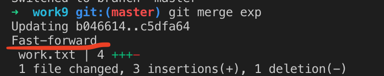

 

**2) exp 브런치를 지우고 master를 뒤에 파일로 돌리고 싶을 때**

    1. git checkout master 
    2. git branch -d exp // 병합하기 전에 브랜치를 지우려면 -D를 하거나 병합후 소문자로 해도됨 
    3. git reset —hard 원하는파일id 

 

**3) branch conflict 상태에서 병합하는 것 다시 연습**

    git checkout master && git merge exp

좀 더 전문적인 도구를 이용한 병합 (충돌시) 

    git mergetool 

    git merge —abort 병합 취소 

git add 'conflicted file name' → 충돌 작업을 해결했다는 것을 알려줌 

.orlg 파일 (.git 에 저장되어있을 거임. 이건 위험한 작업을 하고 난 다음, 실패했을 때 빠져나오는 것을 도와주는 파일. 파괴작업 전의 origin. 지우는 거 추천 ㅎㅎ) 

    git merge —help 모든 명령어에 —help 치면 사용어가 뜸 

 

    vi (명령 실행어) 파일.txt 

    명령어를 입력하기 위해서는 i (imput) 누르고 쓸 수 있음 

    ctrl+c 명령어도 돌아감 (insert) 사라짐

    dd → 내용 삭제됨 

    끝내고 싶을때 다시 ctrl+c로 돌아와서 :wq (저장하고 끄기) 

 

## 저장하기 

- 백업 핵심 

- 3:zsh

- 내 컴퓨터 : local repo

- github : remote repo

    1. remote repo를 만들기 (github)이 가장 유명 
    2. local repo에 remote repo 셋팅하기 (연결하기) : 동기화 명령 git push 
    3. Git pull

  

## 협업

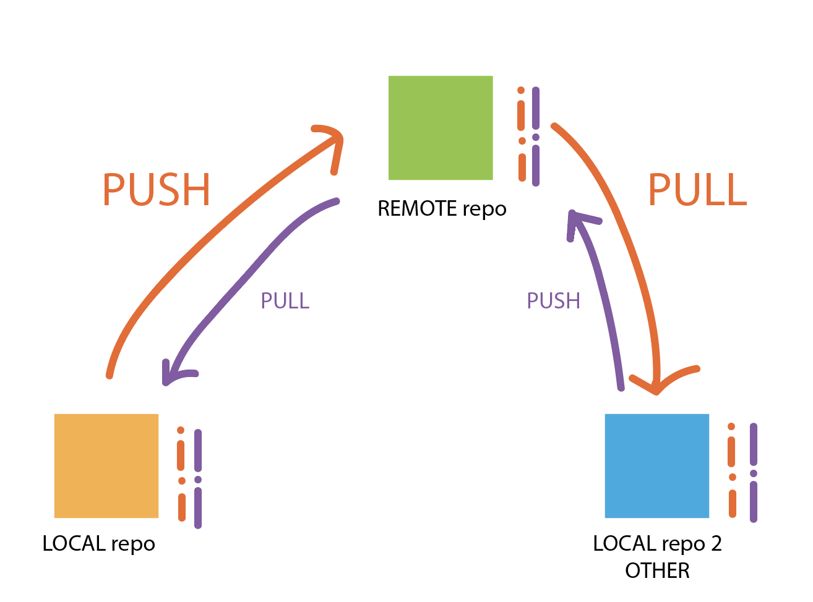

github 들어가서 repo 만들기

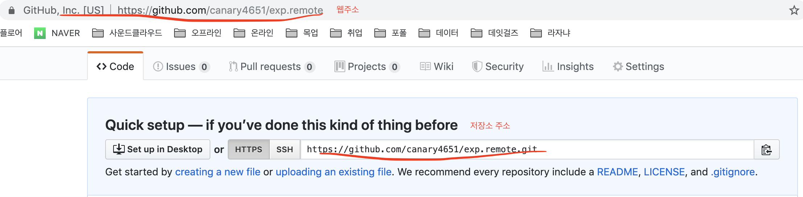

근데 저장소 주소를 hhtps가 아니라 ssh 로 바꾸기!!!

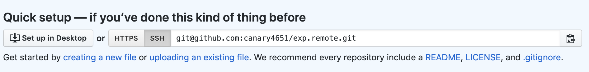

깃 소스코드를 다운로드 받을 수 있음 

    git clone 주소 .(현재 dir) 꼭 써야함 

이러면 내가 받은 소스코드를 현재 dir(.)으로 파일을 다운로드 받게 됨 

git log hell ㅋㅋㅋㅋㅋ 검색해보면 엄청난 것들을 볼 수 있음 

원격 저장소 만들 때 

    or create a new repository on the command line → 처음부터 remote repo만들고 여기서부터 프로젝트 시작 

    or push an existing repository from the command line : 프로젝트 중에 remote repo 만들 때 

해석 

1) or create a new repository on the command line 

    echo "# exp.remote" >> README.md --> README.md 란 파일 만들고 실행
    git init
    git add README.md
    git commit -m "first commit"
    git remote add origin git@github.com:canary4651/exp.remote.git **--> 너의 remote repo는 이거야 하고 origin이란(내가 바꿔도됨! 그냥 관습적으로 붙인 별명) 별명지어줌** 
    git push -u origin master -> local repo에 있는 버전이 remote repo에 올라갔다

 

    git remote -v : 원격 저장소를 자세하게 보여줌 

    git push --set-upstream origin master  → git push -u origin master

→ 로컬 저장소에 브랜치가 여러개가 있을 수 있음. 마스터 브랜치를 원격 저장소랑 로컬 저장소를 동기화할 때 sub 브랜치 이런식으로 이름을 달리할 수 있음 / 그렇기 때문에 같은 이름으로 하려고 해도 setting을 해주어야 하는 데, 그게 바로 위의 명령어 

하고나면 

    → The authenticity of host 'github.com (15.164.81.167)' can't be established.RSA key fingerprint is SHA256:nThbg6kXUpJWGl7E1IGOCspRomTxdCARLviKw6E5SY8.

    Are you sure you want to continue connecting (yes/no)?

—> 요렇게 인증하라는 메세지가 뜸 

 

## ssh에 사용하는 파일 비밀번호 설정 (로컬과 원격 둘다 등록) 

그렇게해서 맞으면 업로드 허용 틀리면 거절 

지역저장소에 비밀번호 만들기 

    ssh-keygen 

    엔터 3번

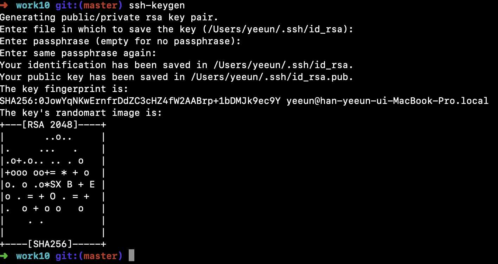

    d /Users/yeeun/.ssh/

        cat id_rsa.pub

그뒤 나오는 말을 빠뜨리지 않고 정교하게 복사 

    ssh-rsa AAAAB3NzaC1yc2EAAAADAQABAAABAQCppnbrfVGut6U03bkMhS5RzxloBZGIpRMplerPlkkj+/e3wYx3CaNO3mcIreNuXbKDytvoBIQ48xelPahR2IZ7rYM/+tI3T8TFGKmzKar2IafLXk4m9XsnLuPXyP0ufbCq6sa3CvpOl1Wv9Ba3jWa2ASRJeCrHejdGxdqi59aFVf0xNB3pZ/+NECdeVChvRQmOy8gdb37uQgsweiIoqUYoWtGQCf1X/B3sWzTB4TmTRix/fwfoGEqHEC6dFdosQ/khb6hb0gsYBDiSyQVy359yLaL55GdGoVlUEmtVQnCR4KuYxfVKYarjOyhsDY489pGg9GvkpOaC72DCTEXnlneF yeeun@han-yeeun-ui-MacBook-Pro.local

 

- .pub (public)약자 이거를 github에 올리는 거임 

- id_rsa → 이 파일은 pri 프라이빗은 절대절대 올리면 안됨 컴퓨터 뚫림 

 

왜냐? pub 파일과 pri 은 유일한 단짝이다 하지만 pub로 pri 파일을 복원시킬 순 없다. 

깃헙 다시 돌아가서 내 이름 밑에 settings 클릭 

(이 비번은 컴터 전체 password 임 다른 프로젝트할때도 씀. 내 사용자 계정의 패스워드) 

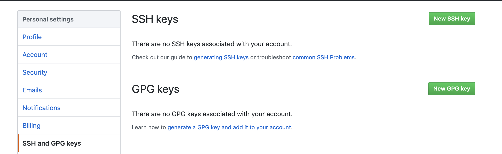

여기다 등록시키면 인증 끝 

그리고 다시 터미널 새로 켜서 

    git push -u origin master

치고 yes 누르면 완성됨 

 

## git과 github 차이점

- local repo에서 사용하는 프로그램이 git 이고 

- git을 원격 저장소로 임대해주는 서비스가 github 

 

그리고 다음부턴 내용 수정하고 커밋한 후

    git push

만해도 올라감 

___
 

## 다른 컴퓨터에서 다운받아올 때 

5: zsh

- 오픈 소스는 다운로드는 되는 데 push는 안됨 그니까 인증을 해야함
- 다른 컴퓨터에서 다시 인증하는 방법은 위 과정을 다시하면 됨
- ssh-keygen 해가지고 다시 깃헙에서 키 생성해서 내 깃헙 계정에 다시 등록해서 하면 됨

협업하는 방법 

(영상 참고) 

다른 컴퓨터에 원격 저장소 가서 **clone with download** 에서 다운 

    git clone [git@github.com](mailto:git@github.com):canary4651/exp.remote.git . (현재dir 빼지말기) 

*협업 저장소만들기*

    새로운 repo 만드는 건 똑같은 데 만들 때 setting 게시판에서 collaborater & team 허용하기 그리고 친구 초대 

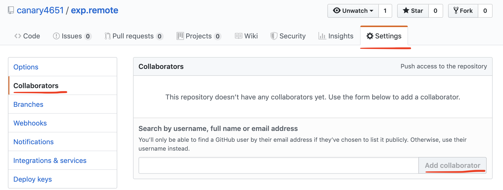

    git commit만 하고 push를 안하면 생기는 origin/mast, origin_head → 내가 커밋한 게 work3인데 아직 원격 저장소에 올리지 않았다 

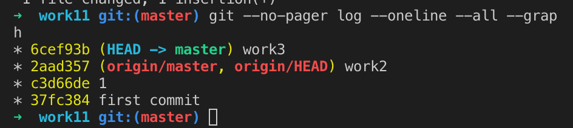

    그러니까 다시 git push

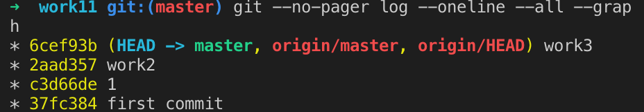

    → 내가 origin master로 동기화 한 후 새로 한 커밋이 없다 

    근데 만약 동시에 push가 되었다면? 

![]./git_images/(Untitled-f598726c-b924-4483-8b44-7acb28d86f7d.png)

    좀 더 늦게 한 얘가 reject됨 그니까...! 자주자주 push 해야함!!! 

 

- 왜냐면 저렇게 reject되면 일단 파일 다운 받아서 충돌 해결하고 올려라 라는 뜻이기 때문에 개고생하지 않으려면 자주 올리기 

- 리젝된 곳에서 git pull 해서 충돌나건 안나건 새로운 커밋이 생기건 암튼 병합 한 후에 다시 push 해야함 

- 문제는 그냥 pull하면 충돌이 일어남. 

- 그래서 git에서는 push 명령어는 하나인데, pull은 여러개가있음 

- 바로 fetch (다운받음) // 충돌이 일어날 거 같은 파일을 fetch로 다운받기 (같은 파일 이름에 다른 내용)

        pull = fetch + merge 

- fast-forward 방식이아니라 merge-commit 방식 (여러개의 브랜치로 나누어진걸 병합)

- fetch를 한거라면 merge 해야하므로

        master로 origin/master를 merge 하면 됨 ; git merge origin/master

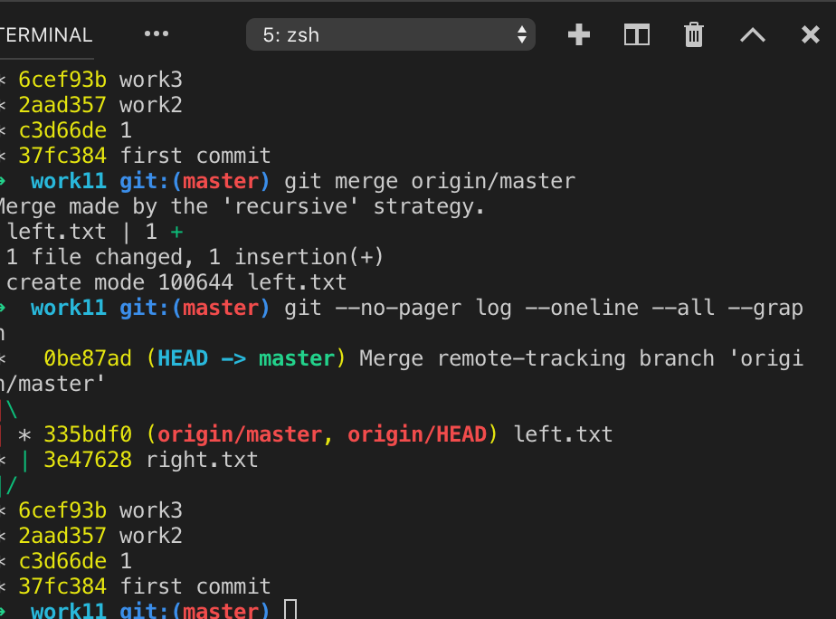

 

***좋은 작업습관 : 작업 전 git pull을 때려본다***

- push / pull 은 습관적으로 많이많이 하자

→ 충돌 일어날 때 문제 해결 해보기 

 
 

## 연습

1. 포르젝트 폴더만들기
2. vs code에 프로젝트 폴더 등록 
3. 프로젝트 폴더를 저장소로 만든다 git init
4. 새로운 파일을 만든다 (work.txt)
5. stage로 등록한다 git add
6. 버전을 만든다 git commit -am "commit message"
7. 실험적인 프로젝트를 위해서 브랜치를 만든다 git branch exp
8. exp에서 작업을 진행한다 git checkout exp 
9. 버전을 생성한다 
10. master에서 작업을 진행한다 Git checkout master
11. 버전을 생성한다 
12. exp의 작업을 master로 병합한다 git checkout master && git merge exp 
13. 충돌 상황을 재현해본다. 
14. github에 원격 저장소를 만듣나 
15. 지금까지의 작업한 지역 저장소를 github 원격 저장소에 등록한다 git remote add origin...
16. 지역 저장소를 업로드 한다 git push
17. 각자의 컴퓨터에 지역 저장소를 복제한다 git clone...
18. 각자 작업해서 버전을 만들고 push를 동시에 해본다 
19. 그리고 생기는 상황을 같이 논의하고 토론해서 분석해서 해결한다 ^^